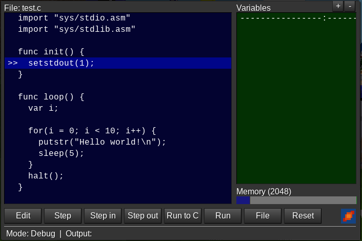

# Beduino

Beduino is a 16-bit micro-controller system inspired by Arduino boards and kits. It can be programmed in a C like programming language [Cipol](https://github.com/joe7575/vm16/wiki/Cipol-Language-Reference).

To be able to use Beduino, a basic knowledge of programming languages would be useful.

The mod `beduino` is based on the mod [vm16](https://github.com/joe7575/vm16), which provides the development environment with editor, file system, compiler, assembler, and debugger.

Apart from vm16, `beduino` has no other mod dependencies. But to be useful, other technology oriented mods or games are necessary.

This manual describes the standard functionality that applies to all use cases. Mod/game specific features/extensions are not covered here.


## Technical Data

The mod `beduino`  uses the virtual machine from `vm16`. The performance default values for the CPU are:

- call cycle_time = 200 ms
- instructions per cycle = 10000
- input costs in number of instructions = 1000
- output costs in number of instructions = 5000
- system costs in number of instructions = 2000
- memory size in words = 2048

The means that the CPU can execute up to 100,000 instructions per second, but e.g. each call of the function `output` costs 5000 instructions (max. 20 `output`calls per second). 

Beduino CPU registers are 16-bit wide. The CPU memory is also organized in 16-bit words. 8-bit addressing is not supported. This means, all variables are 16-bit wide and can store values between 0 and 65535. For more info to the CPU, see [VM16 Instruction Set](https://github.com/joe7575/vm16/blob/master/doc/introduction.md).	


## First Steps

- Craft the three blocks "VM16 Programmer", "VM16 File Server", "Beduino Controller".
- Place the server and the controller.
- Left-click with the programmer on both blocks to connect the programmer with server and controller.
- Place the programmer in front of the controller (in reality, the programmer can be placed anywhere since it is already connected).
- Open the programmer menu and press the "Init" button. This will initialize the controller and connect any existing I/O module to the controller.
- Open the file "demo/example1.c" with a double-click on the file name. 
- Translate the example into machine language with the button "Debug" and start the program with "Run". The program will send some ASCII characters to the status line of the programmer.

If you see characters like "@ABCDEFG..." then you did everything right, congratulations!


## Hello World

The "Hello world" program is probably the most famous program. In the Beduino programming language, it looks like this:

```c
import "sys/stdio.asm"
import "sys/stdlib.asm"

func init() {
  setstdout(1); // switch to terminal output
  putstr("Hello world!\n");
}

func loop() {
  halt(); // abort program execution
}
```

- `import` instructions allow to use external functions and variables (here: `putstr` and `halt`)
- the function `init`  is called only once and is typically used for initializing purposes. We use this to output the text string "Hello world!"
- the  function `loop` is cyclically called, typically every 200 ms. If you code is to huge and needs more time, the next call of `loop` will be delayed. Because the program is about to end, the function `halt`  is used. Without the `halt` function the program will run endless.

To test this program:

- Generate a new file "test.c" by typing the file name into the text field in the button row and click on the button "New".
- Open the new generated file with a double-click on the file name.
- Copy the text from this manual into the editor window.
- Start the program with the button "Execute". You will see the "Hello world!" on the terminal window.


## Editor/Debugger

The programmer has an integrated editor and debugger. It allows to implement and debug/test your own programs. Programs can be implemented in the C like language [Cipol](https://github.com/joe7575/vm16/wiki/Cipol-Language-Reference) or in [Assembler](https://github.com/joe7575/vm16/blob/master/doc/asm.md). The file system on the right provides example programs in both languages and many system and library modules to be used in your programs.

For the first debugging steps we use the following modified "Hello world" program. Copy the code below and generate a new program "test.c".

```c
import "sys/stdio.asm"
import "sys/stdlib.asm"

func init() {
  setstdout(1);
}

func loop() {
  var i;

  for(i = 0; i < 10; i++) {
    putstr("Hello world!\n");
    sleep(5);
  }
  halt();
}
```

Please note that all changes on your program have to be stored with the "Save" button. Any other actions will lose your changes.

Your program can now:

- Directly be executed with "Execute". It will output "Hello world!" 10 times.
- Compiled with "Compile". "Compile" generates the assembler file "out.asm". Any errors that may have occurred during compilation are output in the first line. To switch back to your program, double-click on the program file name on the right.
- Tested and debugged with "Debug"

This is the debugger window:



On the left you see your program, on the right the current values of your variables and the memory usage of your program (blue for code and green for stack size). The number 2048 is the size of your memory in words. The memory can be expanded using memory chips.

The highlighted line with the ">>" marker is the current code line to be executed next. 

You can new single-step through the program with the "Step" button. After several steps, you see the value of your variable 'i' in hexadecimal and decimal notation.

You can set a breakpoint with a double-click on a code line. Breakpoints are highlighted with the '*' sign. Now you can click "Run" and the program will run until it reaches the breakpoint line. Another double-click on a breakpoint will delete the breakpoint again.

"Run to C" means run to cursor, in this case the current highlighted line. Therefore:

- Reset the program execution with "Reset"
- Delete all breakpoints if available
- Click on the line `putstr("Hello world!\n");`
- Click on "Run to C". The program starts and stops at this line

"Step in" and "Step out" are useful to step into you own functions.

**Hint:** Sometimes the "Step out" button does not work as expected. This is typically the case, if a line of code is missing to step to.

For example:

```c
for(i = 0; i < MAX; i++) {
  my_func(0);
}
```

A "Step out" from the function `my_func` will not find an appropriate code line. A workaround for this is:

```c
for(i = 0; i < MAX; i++) {
  my_func(0);
  ;  // <-- Add this "empty" line as helper line
}
```

Now you can step in/out as expected without generating extra code.

### Further Hints

- Program source files have to have the ending ".c". Files with other endings can be generated, but can't be translated/compiled.
- Folders like "lib/" or "sys/" are not real folders. The prefixes are part of the file name and help to sort the files accordingly.
- To delete a file, open the file with the editor, delete the text, and save the file again.
- The "ro" behind the file names means "read-only". "read-only" files can't be changed or deleted. They are used for examples and for standard library functions and definitions.


## Router

Routers are used to send messages from one to another controller. Each controller needs its own router. Each router automatically gets an unique number/address, which is used for the addressing. The 16 bit address allows up to 65535 routers.

```c
// Send a message via router.
// `address` is the router destination address
func send_msg(address, msg);

// Receive a message via router.
// Function returns the sender address or 0.
func recv_msg(buff, size);
```

The maximum messages length is 64 words. 

> **Note**
> Word 0 of each messages buffer is the msg size, which is the number of words without the size itself (see example `tx_demo.c`).

The router comes with two example programs to demonstrate the message communication:

- `tx_demo.c`  to cyclically send a message to router #2
- `rx_demo.c` to receive and output messages

Copy the code from `tx_demo.c` into your own file and adapt the router address to your needs.

#### Address Filter

Router allow to set an address filter. By default, messages from all other controllers are received. By means of the address list (white list) the number of valid addresses can be limited. Enter the addresses of the allowed routers in the router menu. Addresses must be separated by spaces, e.g.: "123 234 235".


## Broker

The broker is used for a server/broker based communication between controllers. The broker will store received messages and provides the messages to other controllers, even if the original message source/sender is not available anymore.

Messages for the broker have to have a topic value. The topic is used to publish and request a dedicated messages.

Each broker automatically gets an unique number/address, which is used for the addressing.

```c
// Send a message to the broker.
// `address` is the router destination address
// `topic` value is used as message identifier
func publish_msg(address, topic, msg);
    
// Read a message from the broker.
// Function returns 1 (success) or 0 (no msg).
// `buff` is a buffer, used for the received message
// `size` ist the buffer size in words
func request_msg(address, topic, buff, size);
```

The maximum messages length is 64 words. Valid values for a topic are 1..100.

> **Note**
> Word 0 of each messages buffer is the msg size, which is the number of words without the size itself (see example pub_demo.c`).

The broker comes with two example programs to demonstrate the publish/request process:

- `pub_demo.c`  to cyclically publish/send a message to broker #5
- `req_demo.c` to request/receive a messages from broker #5

Copy the demo code into your own files and adapt the broker address to your needs.

#### Address Filter

Broker (like router) allow to set an address filter. By default, messages from all controllers are received. By means of the address list (white list) the number of valid addressed can be limited. Enter the addresses of the allowed publishing controllers in the broker menu. Addresses must be separated by spaces, e.g.: "123 234 235".

Only the receipt of messages can be restricted, requesting a message from the broker is always allowed (if the topic number is known).


## Further Information

- [Cipol Language Reference](https://github.com/joe7575/vm16/wiki/Cipol-Language-Reference)
- [VM16 Instruction Set](https://github.com/joe7575/vm16/blob/master/doc/introduction.md)
- [Assembler Manual](https://github.com/joe7575/vm16/blob/master/doc/asm.md)

